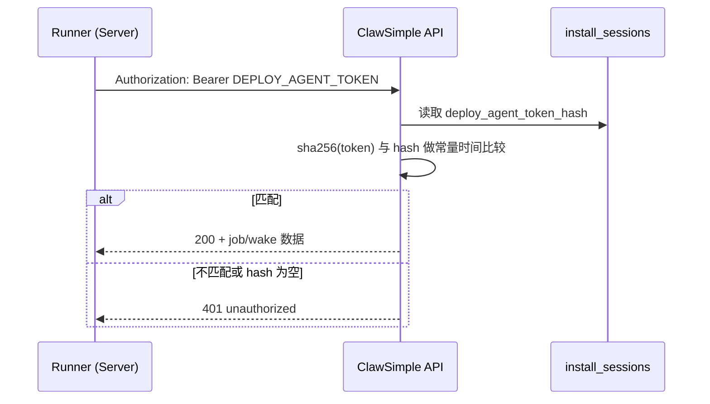

# deploy_agent_token_hash 新手说明

这篇文档解释三个问题：

1. `deploy_agent_token_hash` 是什么，有什么作用？
2. 为什么它会“失效”？
3. 正确的更新机制和排障方法是什么？

## 1) 它是什么

`deploy_agent_token_hash` 是 `install_sessions` 表里的一个字段，用来保存 **部署机器 Runner 鉴权令牌的哈希值**（不是明文）。

- 明文字段名：`DEPLOY_AGENT_TOKEN`（保存在机器 `/opt/clawsimple/.env.app`）
- 数据库存储：`deploy_agent_token_hash = sha256(DEPLOY_AGENT_TOKEN)`

核心目的：即使数据库泄露，也拿不到可直接调用控制面 API 的明文 token。

## 2) 它的作用（请求链路里如何使用）

Runner 访问控制面 API（例如 `/skills/wake`、`/skills/jobs/next`、`/skills/jobs/{id}/ack`）时，会带：

- `Authorization: Bearer <DEPLOY_AGENT_TOKEN>`

服务端会：

1. 从请求头拿到 Bearer token。
2. 对 token 做 `sha256`。
3. 与 `install_sessions.deploy_agent_token_hash` 做常量时间比较。
4. 一致则通过，不一致则 `401 unauthorized`。

## 3) 更新机制（什么时候生成/变更/清空）

### 3.1 首次部署时生成

部署创建时会：

1. 生成随机 token（`generateDeployAgentToken()`）。
2. 计算 hash（`hashDeployAgentToken()`）。
3. hash 写入 `install_sessions.deploy_agent_token_hash`。
4. 明文 token 写入目标机器环境变量 `DEPLOY_AGENT_TOKEN`。

### 3.2 特定流程会轮换（rotate）或重置

例如 OVH 回收流程（lockdown）会重新生成 token 给回收 Runner 使用，后续再清空 hash。

### 3.3 部分业务流程会清空 hash

如订阅到期/回收完成等流程里，系统会把 `deploy_agent_token_hash` 置空，避免旧机器继续访问。

## 4) “失效”常见原因

最常见不是哈希算法问题，而是 **明文 token 与数据库 hash 不再匹配**：

1. 机器上 `.env.app` 被回滚到旧备份，里面是旧 token。
2. 数据库 token hash 已轮换，但机器没同步到新 token。
3. SID 对应关系变了（机器被重新分配），机器仍用旧 SID/token。
4. hash 被业务流程清空（置 `null`），机器还在继续轮询。

表现通常是：

- runner 服务看起来 `active`，但 job 长期 `pending`。
- 手动请求 `GET /api/deploy/{sid}/skills/wake` 返回 `401 unauthorized`。

## 5) 快速排障（新手最短路径）

### 5.1 先确认机器侧 token

```bash
grep -n '^SID=\\|^DEPLOY_AGENT_TOKEN=\\|^CLAWSIMPLE_API_BASE_URL=' /opt/clawsimple/.env.app
```

### 5.2 用机器上的 token 直接打 wake 接口

```bash
curl -i \
  -H "authorization: Bearer $DEPLOY_AGENT_TOKEN" \
  "$CLAWSIMPLE_API_BASE_URL/api/deploy/$SID/skills/wake"
```

- `200`：鉴权通过
- `401`：高概率 token/hash 不匹配

### 5.3 再确认控制面 hash 是否存在

```sql
select id, deploy_agent_token_hash
from install_sessions
where id = '<SID>';
```

- `null`：该部署当前不允许 runner 鉴权（需要走平台流程重新下发）
- 非 `null` 但仍 401：多半机器 token 已过期/被回滚

## 6) 安全建议

1. 不要把 `DEPLOY_AGENT_TOKEN` 写入日志或聊天消息。
2. 不要长期复用同一个 token；应允许轮换。
3. 恢复 `.env.app` 备份后，优先验证 token 与 SID 是否仍有效。
4. 发现 401 时优先走“重新下发 token”流程，不建议手工硬改数据库。

## 7) 代码定位（项目上下文）

- token 生成/哈希：`src/lib/deploy/agent-token.ts`
- 鉴权校验：`src/lib/deploy/agent-jobs.ts` (`verifyDeployAgentAccess`)
- 首次部署写入 hash：`src/app/api/deploy/route.ts`
- 终止/回收时轮换或清空：`src/app/api/deploy/[sid]/route.ts`、`src/app/api/deploy/[sid]/skills/jobs/[jobId]/ack/route.ts`
- runner 发送 Bearer token：`src/lib/runner/agent-jobs-runner.mjs`

## 8) 一张图看懂


